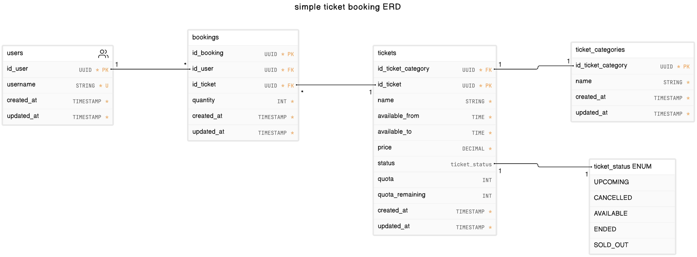

# Ticket Project Spring Boot

APIs simple service for concert ticket reservation.

## Requirement

- Java **21**
- PostgreSQL **16.2**
- ~~Maven **3.9.6**~~

## Functional App

- User is able to search available concerts
- User is able to book a ticket according to selected concert within **specific hour**, with **limited number** of tickets
  - example: 1000 tickets can only purchase between 09:00 AM to 10:100 AM
- User is not allowed to multiple booking requests
- Avoid race booking (prevent excess number of tickets)

## Database Design

Diagram

  
- **users** table
  - made as simple as possible only _username_ column
  - for an easier testing purpose, the username will use as an identity (treated such as api-key) for booking
- **ticket_categories** table
  - to categorize types of tickets (Concert, Tours, Theater)
  - only a _name_ column to make it simpler
- **ticket_status** as enum
  - UPCOMING : Tickets are not yet available for purchase but will be in the future
  - CANCELLED : Tickets have been cancelled
  - AVAILABLE : Tickets are available for purchase
  - ENDED : Tickets are no longer available for sale, even though they haven't been completely sold out
  - SOLD_OUT : All tickets have been sold 
- **tickets** table
  - ticket representation and most of the application functions are here
  - _status_ column is used for **search available tickets (concerts)**
  - _quota_ column to determine the number of tickets
  - _quota_remaining_ column indicates the remaining quantity of tickets available for purchase or allocation **(limited number of tickets)**
  - _available_from_ column specifies the start time during which tickets or bookings become available for purchase or reservation
  - _available_to_ column indicating when bookings or purchasing tickets closes
    - with these _[available_from, available_to]_ columns, the ticket purchase time becomes more specific **(specific hour)**
- **bookings** table
  - representation of the user who purchased the ticket
  - one user  through _id_user_ column can have many different tickets
  - one ticket through _id_ticket_ column can be owned by many different users
  - but one user can only have one same ticket **(not allowed to multiple booking requests)**
    - composite unique index from _id_user_ and _id_ticket_ is the solution

## Specification

- Unit Test
- API Documentations - OpenAPI (Swagger)

## Run App

### Config

- `/src/main/resources/application.yaml` is application config file

### Test

- `$ ./mvnw test`

### Start

- `$ ./mvnw spring-boot:run`
- then open [/docs](http://localhost:8080/docs) path

### Start (Docker)

- `$ docker-compose up`
- then open [/docs](http://localhost:8080/docs) path
