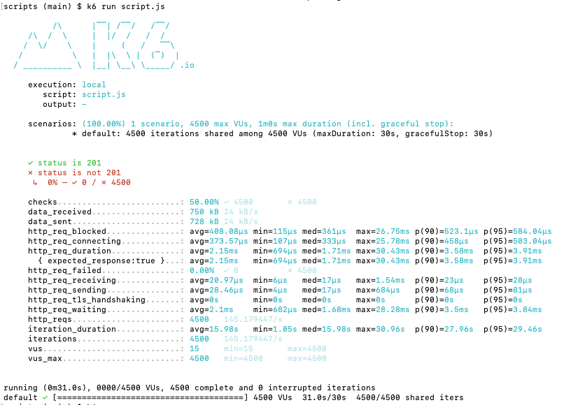
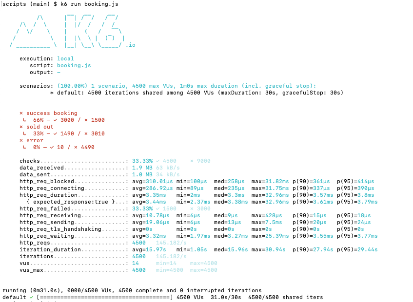

# Ticket Project Spring Boot

APIs simple service for concert ticket reservation.

## Requirement

- Java **21**
- PostgreSQL **16.2**
- ~~Maven **3.9.6**~~

## Functional App

- User is able to search available concerts
- User is able to book a ticket according to selected concert within **specific hour**, with **limited number** of tickets
  - example: 1000 tickets can only purchase between 09:00 AM to 10:100 AM
  - <details><summary>tickets table</summary>

    ```java
    @Entity
    @Table(name = "tickets")
    public class Ticket {
        @Column(name = "available_from", nullable = false)
        private java.sql.Time availableFrom;

        @Column(name = "available_to", nullable = false)
        private java.sql.Time availableTo;

        @Column(name = "quota", nullable = false)
        private Integer quota;

        @Column(name = "quota_remaining", nullable = false)
        private Integer quotaRemaining;
    }
    ```
    </details>
- User is not allowed to multiple booking requests
  - <details><summary>composite unique index</summary>

    ```java
    @Table(name = "bookings", uniqueConstraints = {
            @UniqueConstraint(columnNames = {"id_user", "id_ticket"})
    });
    ```
    </details>
- Avoid race booking (prevent excess number of tickets)
  - <details><summary>isolation level serializable</summary>

    ```java
    @Override
    @Transactional(isolation = Isolation.SERIALIZABLE)
    public UserBooking create(@NonNull Booking booking) {}
    ```
    </details>

## Database Design

<details>
<summary>Diagram</summary>


  
- **users** table
  - made as simple as possible only _username_ column
  - for an easier testing purpose, the username will use as an identity (treated such as api-key) for booking
- **ticket_categories** table
  - to categorize types of tickets (Concert, Tours, Theater)
  - only a _name_ column to make it simpler
- **ticket_status** as enum
  - UPCOMING : Tickets are not yet available for purchase but will be in the future
  - CANCELLED : Tickets have been cancelled
  - AVAILABLE : Tickets are available for purchase
  - ENDED : Tickets are no longer available for sale, even though they haven't been completely sold out
  - SOLD_OUT : All tickets have been sold 
- **tickets** table
  - ticket representation and most of the application functions are here
  - _status_ column is used for **search available tickets (concerts)**
  - _quota_ column to determine the number of tickets
  - _quota_remaining_ column indicates the remaining quantity of tickets available for purchase or allocation **(limited number of tickets)**
  - _available_from_ column specifies the start time during which tickets or bookings become available for purchase or reservation
  - _available_to_ column indicating when bookings or purchasing tickets closes
    - with these _[available_from, available_to]_ columns, the ticket purchase time becomes more specific **(specific hour)**
- **bookings** table
  - representation of the user who purchased the ticket
  - one user  through _id_user_ column can have many different tickets
  - one ticket through _id_ticket_ column can be owned by many different users
  - but one user can only have one same ticket **(not allowed to multiple booking requests)**
    - composite unique index from _id_user_ and _id_ticket_ is the solution
</details>

## Specification

- Unit Test
- Load Test
- API Documentations - OpenAPI (Swagger)

## Run App

### Config

- `/src/main/resources/application.yaml` is application config file

### Test

#### Unit Test

- `$ ./mvnw test`

#### Load Test

- using **k6**
- `scripts` directory as k6 script files
- `$ k6 run <script.js>`  run the script

example: (150 RPS target)

- <details>
  <summary>create user</summary>
  
  

  Total 4500 requests with different VUs (4500) and all requests have status 201 meaning the user was created successfully.  
  **RPS: 145**

  </details>
- <details>
  <summary>booking</summary>
  
  Before run booking script, create a _ticket-category_ first then create a _ticket_ with _**status AVAILABLE**_ and _**quota 3000**_

  ```json
  {
    "id": "aed78802-5c75-4714-8500-a971a0c9a210",
    "ticket_category_id": "7a16e0ba-8e0a-472a-b1a1-e13374cc6f45",
    "name": "Dangdut Mania Concert 2024",
    "status": "AVAILABLE",
    "quota": 3000,
    "quotaRemaining": 3000,
    "available_from": "08:00 PM",
    "available_to": "10:00 PM"
  }
  ```
  
  `$ k6 run booking.js`
  
  

  Total 4500 requests with different VUs (4500)  
  **RPS: 145**  
  only _66% of total requests_, that means only **3000 requests** were successfully booked, no excess tickets sold as expected  
  _33% of total requests_, they ran out of tickets  
  and only _0%_ or _10 users out of  4500 users_ experienced an error

  </details>

### Start

- `$ ./mvnw spring-boot:run`
- then open [/docs](http://localhost:8080/docs) path

### Start (Docker)

- `$ docker-compose up`
- then open [/docs](http://localhost:8080/docs) path
